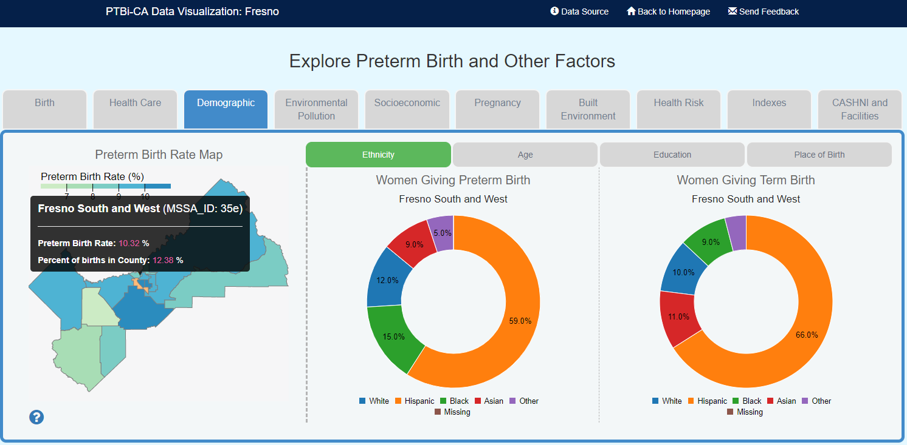

<h2 align="center">
 
PTBi-Viz: <i>viz-map-pie</i>

</h2>

  

<table>
<tr>
<td> 
<b><i>viz-map-pie</i></b> is the visualization component combining an interactive map with two interactive pie charts to display additional attributes of the interested region at the same time.
 
 
We found this function very useful for <b>displaying numeric variables that are classified into groups</b>, such as data from the Census (ethinicity or income level breakdown of), or data from public health service records (such as the Office of Statewide Health Planning and Development (OSHPD) data we are showing on PTBi-Viz).
</td>
</tr>
</table>

---
