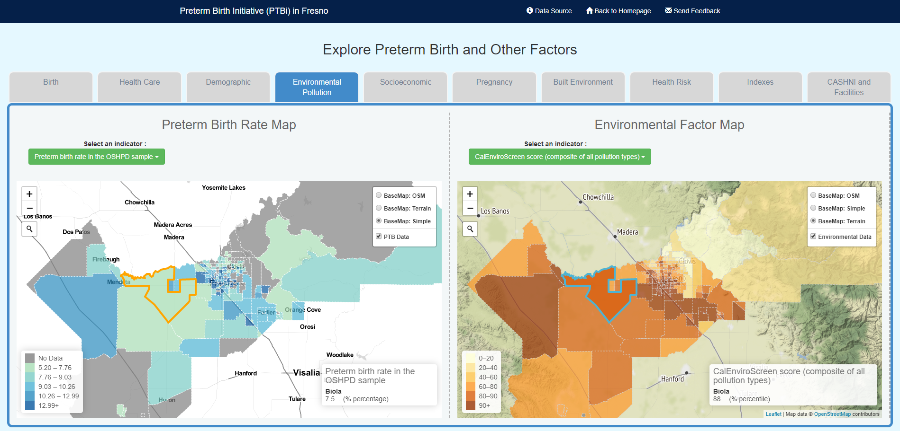

<h2 align="center">
 
PTBi-Viz: <i>viz-map-sync</i>

</h2>

  

<table>
<tr>
<td> 
 <b><i>viz-map-sync</i></b> is the visualization component with two synchronizing maps (left and right) to provide the ability to <b>compare preterm birth data with other factors side-by-side</b>. 
 
 
We found this function very useful for displaying factors and variables with a geographic distribution pattern (such as CalEnviroScreen data), or for data that comes at an aggregated geographic resolution (such as census data).
</td>
</tr>
</table>

