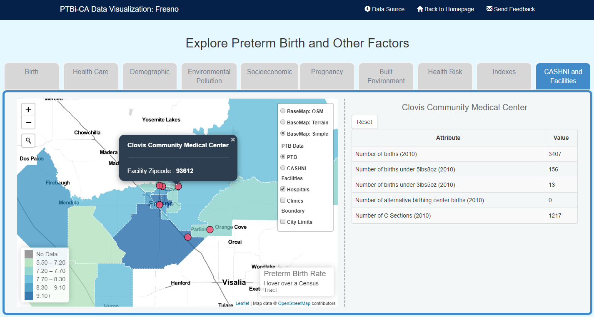

<h2 align="center">
 
PTBi-Viz: <i>viz-map-table</i>

</h2>

  

 

<table>
<tr>
<td> 
<b><i>viz-map-table</i></b> is the visualization component combining a interactive map with a table to display extra attributes of the selected feature at the same time. 
 
 
We found this function very useful for <b>displaying features with extended amount of attributes</b> (such as data for each hospital/clinic location).
</td>
</tr>
</table>

---